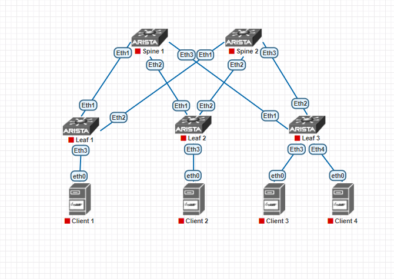

## **Основы проектирования сети**
## **Цель:**
  * Собрать схему CLOS;
  * Распределить адресное пространство
## **Описание/Пошаговая инструкция:**
1. Собрать топологию CLOS
2. Распределить адресное пространство для Underlay сети
3. Зафиксировать в документации план работ, адресное пространство, схему сети, настройки

### **Схема сети**

## **Принцип распределения ip адресов:**
Адреса из пространства 10.0.0.0/8 распределены следующим образом:
 1. Для каждого ЦОДа выделяется сеть 10.Dn.0.0/13, где Dn для первого ЦОДА будет равен 0, Dn для второго ЦОДа - 8, для третьего - 16 и т.д.
 2. Внутри ЦОДа принцип распределения адресов следующий:

    * Loopback0 - 10.Dn.S(L)n.X/32, где Dn - номер сети ЦОДа, S(L)n - номер Spine (Leaf), X = 1 для Spine, X = 2 для Leaf;
    * Loopback1 - 10.Dn+1.S(L)n.X/32, где Dn - номер сети ЦОДа, S(L)n - номер Spine (Leaf), X = 1 для Spine, X = 2 для Leaf;
    * P2P Links Spine-Leaf - 10.Dn+2.Sn.X/31, где Dn - номер сети ЦОДа, Sn - номер Spine, X = (Ln-1)*2, где Ln - номер Leaf
    * Резерв - 10.Dn+3.0.0/16, Dn - номер сети ЦОДа
    * Сервисы - 10.Dn+4.0.0/14, где Dn - номер сети ЦОДа
  ## **Конфигурация устройств**