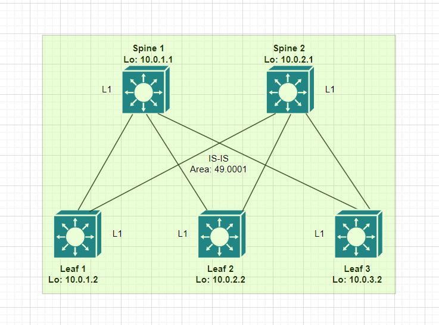
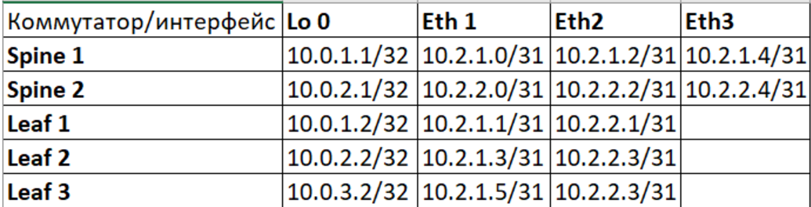

## **Underlay. IS-IS**
## **Цель: Настроить IS-IS для Underlay сети**
## **Описание/Пошаговая инструкция:**
1. Настроить IP адресацию на физических и Loopback интерфейсах всех Spine и Leaf
2. Настроить на всех устройствах ospf процессы, запустить ospf на всех линках между Spine и Leaf, а также на Loopback интерфейсах
3. Настроить OSPF-аутентификацию
4. Настроить BFD
5. Убедиться в наличии одинаковой LSDB базы на всех устройствах, проверить IP связность между Loopback интерфейсами

### **Схема сети**


## **Выполнение работы:**
1. Настраиваем адресацию интерфейсов устройств согласно таблицы:

2. Создаем OSPF процесс на каждом коммутаторе, указываем router-id равный ip адресу loopback интерфейса, разрешаем работу ospf непосредственно на p2p линках, запрещаем на остальных интерфейсах:
```
Spine 1:

router ospf 1
   router-id 10.0.1.1
   passive-interface default
   no passive-interface Ethernet1
   no passive-interface Ethernet2
   no passive-interface Ethernet3
```
3. Производим настройку ospf на интерфейсах, указываем тип сети point-to-point, настраиваем аутентификацию. В качестве зоны OSPF выбрана 1, backbone зона зарезервирована на случай расширения сети (добавление новых ЦОДов, SuperSpine и т.д.):
```
Spine 1:

interface Ethernet1
   description -=p2p_Leaf1=-
   no switchport
   ip address 10.2.1.0/31
   ip ospf network point-to-point
   ip ospf authentication
   ip ospf authentication-key 7 s28hXI3UjcXIxK9yHuixVw==
   ip ospf area 0.0.0.1

interface Loopback0
   ip address 10.0.1.1/32
   ip ospf area 0.0.0.1
```
4. Проверяем что OSPF соседство между Spine и Leaf установлено, базы данных LSDB одинаковы на всех устройствах (так как используются P2P линки, выборы DR и BDR производиться не будут, маршрутизаторы обмениваются только LSA 1 типа):

```
Spine1#show ip ospf neighbor
Neighbor ID     Instance VRF      Pri State                  Dead Time   Address         Interface
10.0.1.2        1        default  0   FULL                   00:00:29    10.2.1.1        Ethernet1
10.0.2.2        1        default  0   FULL                   00:00:38    10.2.1.3        Ethernet2
10.0.3.2        1        default  0   FULL                   00:00:35    10.2.1.5        Ethernet3

Spine1#show ip ospf database 

            OSPF Router with ID(10.0.1.1) (Instance ID 1) (VRF default)


                 Router Link States (Area 0.0.0.1)

Link ID         ADV Router      Age         Seq#         Checksum Link count
10.0.2.1        10.0.2.1        1718        0x8000002f   0x1d98   7
10.0.2.2        10.0.2.2        1604        0x80000048   0xa556   5
10.0.3.2        10.0.3.2        1608        0x80000006   0xfc36   5
10.0.1.2        10.0.1.2        1614        0x80000528   0x8e93   5
10.0.1.1        10.0.1.1        1603        0x800000b3   0xdd5c   7

Leaf3#show ip ospf neighbor 
Neighbor ID     Instance VRF      Pri State                  Dead Time   Address         Interface
10.0.1.1        1        default  0   FULL                   00:00:36    10.2.1.4        Ethernet1
10.0.2.1        1        default  0   FULL                   00:00:37    10.2.2.4        Ethernet2

Leaf3#show ip ospf database 

            OSPF Router with ID(10.0.3.2) (Instance ID 1) (VRF default)


                 Router Link States (Area 0.0.0.1)

Link ID         ADV Router      Age         Seq#         Checksum Link count
10.0.2.1        10.0.2.1        1771        0x8000002f   0x1d98   7
10.0.2.2        10.0.2.2        1659        0x80000048   0xa556   5
10.0.1.2        10.0.1.2        1668        0x80000528   0x8e93   5
10.0.1.1        10.0.1.1        1658        0x800000b3   0xdd5c   7
10.0.3.2        10.0.3.2        1660        0x80000006   0xfc36   5

```
5. Проверяем связность между Loopback интерфейсами:
```
Leaf3#ping 10.0.1.2 source 10.0.3.2
PING 10.0.1.2 (10.0.1.2) from 10.0.3.2 : 72(100) bytes of data.
80 bytes from 10.0.1.2: icmp_seq=1 ttl=63 time=36.6 ms
80 bytes from 10.0.1.2: icmp_seq=2 ttl=63 time=34.4 ms
80 bytes from 10.0.1.2: icmp_seq=3 ttl=63 time=31.4 ms
80 bytes from 10.0.1.2: icmp_seq=4 ttl=63 time=26.7 ms
80 bytes from 10.0.1.2: icmp_seq=5 ttl=63 time=24.6 ms
--- 10.0.1.2 ping statistics ---
5 packets transmitted, 5 received, 0% packet loss, time 102ms
rtt min/avg/max/mdev = 24.683/30.818/36.665/4.523 ms, pipe 3, ipg/ewma 25.542/33.406 ms

Leaf3#traceroute 10.0.1.2 source 10.0.3.2
traceroute to 10.0.1.2 (10.0.1.2), 30 hops max, 60 byte packets
 1  10.2.1.4 (10.2.1.4)  52.831 ms  54.175 ms  65.019 ms
 2  10.0.1.2 (10.0.1.2)  107.066 ms  112.241 ms  130.119 ms
```
6. Настраиваем BFD для минимизации задержек при переключении в случае обрыва одного из линков (так как виртуальная среда имеет свои ограничения, уменьшение интервалов и таймеров на лабораторном стенде не производил):

```
Spine 1:

router ospf 1
   bfd default

Spine1#show bfd peers 
VRF name: default
-----------------
DstAddr       MyDisc    YourDisc  Interface/Transport    Type           LastUp 
--------- ----------- ----------- -------------------- ------- ----------------
10.2.1.1  3711282806   355653669        Ethernet1(15)  normal   12/01/24 09:15 
10.2.1.3    83586903  1204914201        Ethernet2(16)  normal   12/01/24 09:15 
10.2.1.5  2274623782  2485770041        Ethernet3(17)  normal   12/01/24 09:15 

   LastDown            LastDiag    State
-------------- ------------------- -----
         NA       No Diagnostic       Up
         NA       No Diagnostic       Up
         NA       No Diagnostic       Up

```
