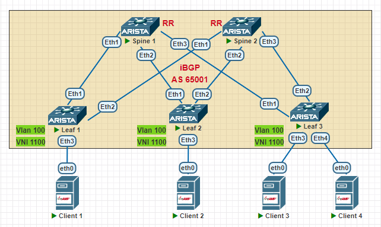
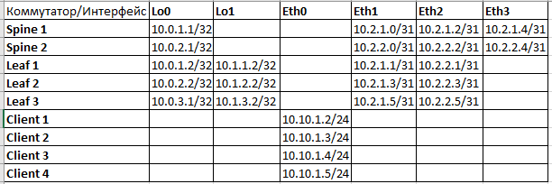

## **VxLAN. L2 VNI**
## **Цель: Настроить Overlay на основе VxLAN EVPN для L2 связанности между клиентами**
## **Описание/Пошаговая инструкция:**
1. Настроить BGP peering между Leaf и Spine в Address Family l2vpn evpn.
2. Добавить клиентский Vlan, связать его с VNI
3. Настроить MAC VRF BGP для клиентского Vlan-а, настроить RD, RT import, RT export.
4. Убедиться в установлении BGP evpn соседства, наличии информации о соседних Vtep на всех Leaf.
5. Убедиться в наличии связности между клиентами.

### **Схема сети**

## **Выполнение работы:**
1. Настраиваем адресацию интерфейсов устройств согласно таблицы:

2. :
```
Spine 1:

router bgp 65001
   router-id 10.0.1.1
   timers bgp 3 9
   neighbor Leaf peer group
   neighbor Leaf remote-as 65001
   neighbor Leaf next-hop-self
   neighbor Leaf bfd
   neighbor Leaf route-reflector-client
   neighbor Leaf password 7 LPaYUKVuzesyD+boXlQBAw==
   neighbor 10.2.1.1 peer group Leaf
   neighbor 10.2.1.3 peer group Leaf
   neighbor 10.2.1.5 peer group Leaf

Leaf 2:

route-map Import_Connected permit 10
   match interface Loopback0
route-map Import_Connected permit 20
   match interface Loopback1
router bgp 65001
   router-id 10.0.2.2
   maximum-paths 2
   neighbor Spine peer group
   neighbor Spine remote-as 65001
   neighbor Spine bfd
   neighbor Spine password 7 ORZL65NaJ0uIN5uX41Yy2Q==
   neighbor 10.2.1.2 peer group Spine
   neighbor 10.2.2.2 peer group Spine
   redistribute connected route-map Import_Connected
```
3. Проверяем что BGP соседство между Spine и Leaf установлено, на всех Leaf есть маршруты к Loopback интерфейсам соседних лифов:

```
Leaf1#show ip bgp summary 
BGP summary information for VRF default
Router identifier 10.0.1.2, local AS number 65001
Neighbor Status Codes: m - Under maintenance
  Neighbor         V  AS           MsgRcvd   MsgSent  InQ OutQ  Up/Down State   PfxRcd PfxAcc
  10.2.1.0         4  65001           2139      2134    0    0 00:06:10 Estab   4      4
  10.2.2.0         4  65001           1329      1328    0    0 00:06:10 Estab   4      4

Leaf2#show ip route 
Gateway of last resort is not set

 B I      10.0.1.2/32 [200/0] via 10.2.1.2, Ethernet1
                              via 10.2.2.2, Ethernet2
 C        10.0.2.2/32 is directly connected, Loopback0
 B I      10.0.3.2/32 [200/0] via 10.2.1.2, Ethernet1
                              via 10.2.2.2, Ethernet2
 B I      10.1.1.2/32 [200/0] via 10.2.1.2, Ethernet1
                              via 10.2.2.2, Ethernet2
 C        10.1.2.2/32 is directly connected, Loopback1
 B I      10.1.3.2/32 [200/0] via 10.2.1.2, Ethernet1
                              via 10.2.2.2, Ethernet2
 C        10.2.1.2/31 is directly connected, Ethernet1
 C        10.2.2.2/31 is directly connected, Ethernet2
```
5. Проверяем связность между Loopback интерфейсами:
```
Leaf1#ping 10.0.3.2 source loopback 0
PING 10.0.3.2 (10.0.3.2) from 10.0.1.2 : 72(100) bytes of data.
80 bytes from 10.0.3.2: icmp_seq=1 ttl=63 time=66.6 ms
80 bytes from 10.0.3.2: icmp_seq=2 ttl=63 time=64.1 ms

Leaf1#traceroute 10.0.2.2 source loopback 0
traceroute to 10.0.2.2 (10.0.2.2), 30 hops max, 60 byte packets
 1  10.2.1.0 (10.2.1.0)  44.609 ms  50.512 ms  66.105 ms
 2  10.0.2.2 (10.0.2.2)  74.236 ms  85.868 ms  89.018 ms
```
6. Проверяем что bfd сессии поднялись:

```
Spine2#show bfd peer
VRF name: default
-----------------
DstAddr       MyDisc    YourDisc  Interface/Transport    Type           LastUp 
--------- ----------- ----------- -------------------- ------- ----------------
10.2.2.1   330455026  1628746456        Ethernet1(15)  normal   01/06/25 21:46 
10.2.2.3  2693892819  3211345026        Ethernet2(16)  normal   01/06/25 21:50 
10.2.2.5  3141545174  1270927533        Ethernet3(17)  normal   01/06/25 22:45 

         LastDown            LastDiag    State
-------------------- ------------------- -----
               NA       No Diagnostic       Up
               NA       No Diagnostic       Up
   01/06/25 22:45       No Diagnostic       Up

```
