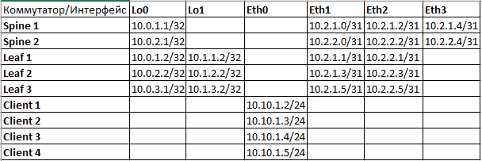
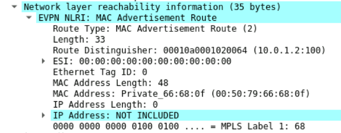

## **VxLAN. L2 VNI**
## **Цель: Настроить Overlay на основе VxLAN EVPN для L2 связанности между клиентами**
## **Описание/Пошаговая инструкция:**
1. Настроить BGP peering между Leaf и Spine в Address Family l2vpn evpn.
2. Добавить клиентский Vlan, связать его с VNI
3. Настроить MAC VRF BGP для клиентского Vlan-а, настроить RD, RT import, RT export.
4. Убедиться в установлении BGP evpn соседства, наличии информации о соседних Vtep на всех Leaf.
5. Убедиться в наличии связности между клиентами.

### **Схема сети**

## **Выполнение работы:**
1. Настраиваем адресацию интерфейсов устройств согласно таблицы:

2. Настраиваем iBGP в качестве Underlay и Overlay. При использовании next-hop-self на Route Reflector (Spine 1 и Spine 2), маршрут evpn не передается на остальные Leaf, поэтому, для связности между loopback интерфейсами leaf, редистрибутим connected network на spine:
```
Spine 1:

ip prefix-list Import_Direct seq 10 permit 10.2.1.0/24 eq 31

route-map Import_Direct permit 10
   match ip address prefix-list Import_Direct

router bgp 65001
   router-id 10.0.1.1
   timers bgp 3 9
   neighbor Leaf peer group
   neighbor Leaf remote-as 65001
   neighbor Leaf route-reflector-client
   neighbor Leaf password 7 LPaYUKVuzesyD+boXlQBAw==
   neighbor Leaf send-community
   neighbor 10.2.1.1 peer group Leaf
   neighbor 10.2.1.3 peer group Leaf
   neighbor 10.2.1.5 peer group Leaf
   redistribute connected route-map Import_Direct

```
3. Настраиваем порты в сторону клиентов на Leaf в режим Access, номер влана указываем 100. Создаем vxlan интерфейс на каждом Leaf, связываем 100 влан с 1100 VNI:

```
Leaf 2:

vlan 100
   name VNI-1100

interface Ethernet3
   switchport access vlan 100

interface Vxlan1
   vxlan source-interface Loopback1
   vxlan udp-port 4789
   vxlan vlan 100 vni 1100

```
4. Настраиваем Address Family evpn на всех устройствам, на Leaf в процессе BGP настраиваем route destignisher, route target import и route target export, а также указываем редистибутить learned mac адреса для VLAN 100:
```
Spine 2:

router bgp 65001
   router-id 10.0.2.1
   timers bgp 3 9
   neighbor Leaf peer group
   neighbor Leaf remote-as 65001
   neighbor Leaf route-reflector-client
   neighbor Leaf password 7 LPaYUKVuzesyD+boXlQBAw==
   neighbor 10.2.2.1 peer group Leaf
   neighbor 10.2.2.3 peer group Leaf
   neighbor 10.2.2.5 peer group Leaf
   redistribute connected route-map Import_Direct

   address-family evpn
      neighbor Leaf activate
      neighbor Leaf next-hop-unchanged

Leaf 3:

router bgp 65001
   router-id 10.0.3.2
   maximum-paths 2
   neighbor Spine peer group
   neighbor Spine remote-as 65001
   neighbor Spine password 7 ORZL65NaJ0uIN5uX41Yy2Q==
   neighbor Spine send-community extended
   neighbor 10.2.1.4 peer group Spine
   neighbor 10.2.2.4 peer group Spine
   redistribute connected route-map Import_Connected
   
   vlan 100
      rd auto
      route-target export auto
      route-target import auto 65001
      redistribute learned
   
   address-family evpn
      neighbor Spine activate
```
5. Проверяем что bgp evpn соседства установлены, evpn маршруты присутствуют на всех leaf:

```
Leaf 1:

Leaf1# show bgp evpn summary 
BGP summary information for VRF default
Router identifier 10.0.1.2, local AS number 65001
Neighbor Status Codes: m - Under maintenance
  Neighbor V AS           MsgRcvd   MsgSent  InQ OutQ  Up/Down State   PfxRcd PfxAcc
  10.2.1.0 4 65001           4928      4924    0    0 03:03:39 Estab   2      2
  10.2.2.0 4 65001           4915      4904    0    0 03:28:35 Estab   2      2

Leaf1#show bgp neighbors 10.2.1.0 evpn received-routes 
BGP routing table information for VRF default
Router identifier 10.0.1.2, local AS number 65001
Route status codes: * - valid, > - active, S - Stale, E - ECMP head, e - ECMP
                    c - Contributing to ECMP, % - Pending BGP convergence
Origin codes: i - IGP, e - EGP, ? - incomplete
AS Path Attributes: Or-ID - Originator ID, C-LST - Cluster List, LL Nexthop - Link Loca
l Nexthop

          Network                Next Hop              Metric  LocPref Weight  Path
 * >Ec    RD: 10.0.2.2:100 imet 10.1.2.2
                                 10.1.2.2              -       100     0       i Or-ID:
 10.0.2.2 C-LST: 10.0.1.1 
 * >Ec    RD: 10.0.3.2:100 imet 10.1.3.2
                                 10.1.3.2              -       100     0       i Or-ID:
 10.0.3.2 C-LST: 10.0.1.1 
```

6. Убеждаемся что leaf получили информацию о соседних VTEP:

```
Leaf 2:

Leaf2# show vxlan vtep 
Remote VTEPS for Vxlan1:

VTEP           Tunnel Type(s)
-------------- --------------
10.1.1.2       flood
10.1.3.2       flood

Total number of remote VTEPS:  2
```

7. Настраиваем ip адреса на клиентах, проверяем связность между клиентами:

```
Client 1:

VPCS> ping 10.10.1.5

84 bytes from 10.10.1.5 icmp_seq=1 ttl=64 time=397.241 ms
84 bytes from 10.10.1.5 icmp_seq=2 ttl=64 time=116.858 ms
84 bytes from 10.10.1.5 icmp_seq=3 ttl=64 time=46.094 ms
84 bytes from 10.10.1.5 icmp_seq=4 ttl=64 time=40.904 ms
84 bytes from 10.10.1.5 icmp_seq=5 ttl=64 time=39.440 ms

VPCS> ping 10.10.1.2

10.10.1.2 icmp_seq=1 ttl=64 time=0.001 ms
10.10.1.2 icmp_seq=2 ttl=64 time=0.001 ms
10.10.1.2 icmp_seq=3 ttl=64 time=0.001 ms
10.10.1.2 icmp_seq=4 ttl=64 time=0.001 ms
10.10.1.2 icmp_seq=5 ttl=64 time=0.001 ms

```
8. Убеждаемся, что на Leaf в mac таблицах есть записи о клиентских устройствах:

```
Leaf 1:

Leaf1#show mac address-table 
          Mac Address Table
------------------------------------------------------------------

Vlan    Mac Address       Type        Ports      Moves   Last Move
----    -----------       ----        -----      -----   ---------
 100    0050.7966.680f    DYNAMIC     Et3        1       0:00:23 ago
 100    0050.7966.6810    DYNAMIC     Vx1        1       0:00:22 ago
 100    0050.7966.6811    DYNAMIC     Vx1        1       0:00:08 ago
 100    0050.7966.6812    DYNAMIC     Vx1        1       0:00:14 ago
Total Mac Addresses for this criterion: 4
```
В перехваченном трафике между Leaf и Spine видим BGP update со 2 типом маршрута:
