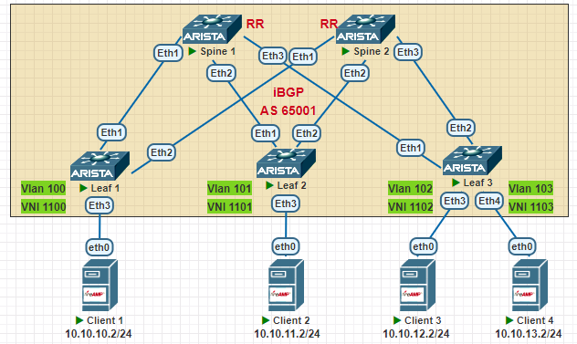
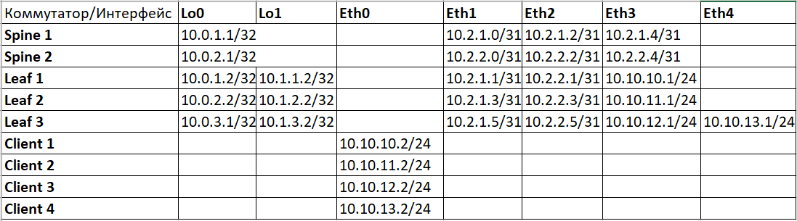

## **VxLAN. L3VNI**
## **Цель: Настроить маршрутизацию в рамках Overlay между клиентами**
## **Описание/Пошаговая инструкция:**
1. Настроить Underlay и Overlay.
2. Настроить EVPN.
3. Добавить на Leaf клиентские VLAN-ы, связать их c VNI
4. Настроить MAC VRF BGP для клиентского Vlan-а, настроить RD, RT import, RT export.
5. Создать VRF "L3" на всех лифах, связать его с VNI
6. Настроить VLANIF интерфейсы на Leaf, связать их с созданным ранее VRF "L3".
7. Настроить ip адреса и шлюз по умолчанию на клиентских машинах.
8. Убедиться в наличии связности между клиентами.
9. Убедиться в наличии двух маршрутов Type-2 на Leaf для каждого Клиента.

### **Схема сети**

## **Выполнение работы:**
1. Настраиваем адресацию интерфейсов устройств согласно таблицы:

2. Настраиваем iBGP в качестве Underlay и Overlay:
```
Spine 1:

route-map Import_Connected permit 10
   match interface Loopback0

router bgp 65001
   router-id 10.0.1.1
   timers bgp 3 9
   neighbor Leaf peer group
   neighbor Leaf remote-as 65001
   neighbor Leaf next-hop-self
   neighbor Leaf route-reflector-client
   neighbor Leaf password 7 BSYOW9qB7q2ag3gSwKzaXWXixR/0fMDN
   neighbor Leaf_lo peer group
   neighbor Leaf_lo remote-as 65001
   neighbor Leaf_lo update-source Loopback0
   neighbor Leaf_lo route-reflector-client
   neighbor Leaf_lo password 7 JRqY1nLadNRvhkjGCpNcBx8q7Vd3IaKY
   neighbor Leaf_lo send-community extended
   neighbor 10.0.1.2 peer group Leaf_lo
   neighbor 10.0.2.2 peer group Leaf_lo
   neighbor 10.0.3.2 peer group Leaf_lo
   neighbor 10.2.1.1 peer group Leaf
   neighbor 10.2.1.3 peer group Leaf
   neighbor 10.2.1.5 peer group Leaf
   redistribute connected route-map Import_Connected
  
   address-family evpn
      no neighbor Leaf activate
      neighbor Leaf_lo activate

   address-family ipv4
      no neighbor Leaf_lo activate


Leaf 2:

route-map Import_Connected permit 10
   match interface Loopback0

route-map Import_Connected permit 20
   match interface Loopback1

router bgp 65001
   router-id 10.0.2.2
   maximum-paths 2
   neighbor Spine peer group
   neighbor Spine remote-as 65001
   neighbor Spine password 7 cvxnRM6ECvqiRRVq05gzqn3sC8FZTVbY
   neighbor Spine_lo peer group
   neighbor Spine_lo remote-as 65001
   neighbor Spine_lo update-source Loopback0
   neighbor Spine_lo password 7 kdTaBtWkPJjFehLXW2l23U7GUnXndnrV
   neighbor Spine_lo send-community extended
   neighbor 10.0.1.1 peer group Spine_lo
   neighbor 10.0.2.1 peer group Spine_lo
   neighbor 10.2.1.2 peer group Spine
   neighbor 10.2.2.2 peer group Spine
   redistribute connected route-map Import_Connected
  
   address-family evpn
      no neighbor Spine activate
      neighbor Spine_lo activate
 
   address-family ipv4
      no neighbor Spine_lo activate


```
3. Настраиваем порты в сторону клиентов на Leaf в режим Access, номер влана указываем 100 для Leaf 1, 101 для Leaf 2, 102 и 103 для Leaf 3. Создаем vxlan интерфейс на каждом Leaf, связываем клиентский влан с VNI 1100, 1101, 1102, 1103 соответственно:

```
Leaf 1:

vlan 100
   name VNI-1100

interface Ethernet3
   switchport access vlan 100

interface Vxlan1
   vxlan source-interface Loopback1
   vxlan udp-port 4789
   vxlan vlan 100 vni 1100

```
4. Настраиваем VRF "L3" на каждом Leaf привязываем к нему VNI 10000, включаем роутинг для данного VRF, создаем VLANIF интерфейсы с адресацией согласно вышеприведенной таблицы, добавляем данные интерфейсы в VRF "L3":
```
Leaf 2:

vrf instance L3
ip routing vrf L3

interface Vlan101
   vrf L3
   ip address 10.10.11.1/24
!
interface Vxlan1
   vxlan vrf L3 vni 10000

```
5. Добавляем VRF "L3" в процесс BGP на каждом Leaf, настраиваем rd, а также route-target import и export:

```
Leaf 1:

router bgp 65001
   vrf L3
      rd 10.1.1.2:1
      route-target import evpn 1:10000
      route-target export evpn 1:10000
      redistribute connected
```

6. Настраиваем ip адреса и default gateway на клиентских устройствах, проверяем доступность шлюзов:

```
Client 1:

VPCS> ping 10.10.10.1

84 bytes from 10.10.10.1 icmp_seq=1 ttl=64 time=100.565 ms
84 bytes from 10.10.10.1 icmp_seq=2 ttl=64 time=17.080 ms
84 bytes from 10.10.10.1 icmp_seq=3 ttl=64 time=7.520 ms
84 bytes from 10.10.10.1 icmp_seq=4 ttl=64 time=18.621 ms
84 bytes from 10.10.10.1 icmp_seq=5 ttl=64 time=8.220 ms

```

7. Проверяем связность между клиентами:

```
Client 1:

VPCS> ping 10.10.10.1

84 bytes from 10.10.10.1 icmp_seq=1 ttl=64 time=100.565 ms
84 bytes from 10.10.10.1 icmp_seq=2 ttl=64 time=17.080 ms
84 bytes from 10.10.10.1 icmp_seq=3 ttl=64 time=7.520 ms
84 bytes from 10.10.10.1 icmp_seq=4 ttl=64 time=18.621 ms
84 bytes from 10.10.10.1 icmp_seq=5 ttl=64 time=8.220 ms

VPCS>  
VPCS> ping 10.10.11.2

84 bytes from 10.10.11.2 icmp_seq=1 ttl=62 time=176.705 ms
84 bytes from 10.10.11.2 icmp_seq=2 ttl=62 time=177.995 ms
84 bytes from 10.10.11.2 icmp_seq=3 ttl=62 time=59.689 ms
84 bytes from 10.10.11.2 icmp_seq=4 ttl=62 time=45.614 ms
84 bytes from 10.10.11.2 icmp_seq=5 ttl=62 time=180.180 ms

VPCS> ping 10.10.12.2

84 bytes from 10.10.12.2 icmp_seq=1 ttl=62 time=224.538 ms
84 bytes from 10.10.12.2 icmp_seq=2 ttl=62 time=40.614 ms
84 bytes from 10.10.12.2 icmp_seq=3 ttl=62 time=59.045 ms
84 bytes from 10.10.12.2 icmp_seq=4 ttl=62 time=40.933 ms
84 bytes from 10.10.12.2 icmp_seq=5 ttl=62 time=50.160 ms

VPCS> ping 10.10.13.2

84 bytes from 10.10.13.2 icmp_seq=1 ttl=62 time=523.879 ms
84 bytes from 10.10.13.2 icmp_seq=2 ttl=62 time=62.481 ms
84 bytes from 10.10.13.2 icmp_seq=3 ttl=62 time=52.144 ms
84 bytes from 10.10.13.2 icmp_seq=4 ttl=62 time=43.690 ms
84 bytes from 10.10.13.2 icmp_seq=5 ttl=62 time=56.717 ms

```
8. Убеждаемся, что на Leaf есть соответсвтующие маршруты EVPN Type 2 и Type 5 :

```
Leaf 1:

Leaf1#show bgp evpn route-type mac-ip 
BGP routing table information for VRF default
Router identifier 10.0.1.2, local AS number 65001
Route status codes: * - valid, > - active, S - Stale, E - ECMP head, e - ECMP
                    c - Contributing to ECMP, % - Pending BGP convergence
Origin codes: i - IGP, e - EGP, ? - incomplete
AS Path Attributes: Or-ID - Originator ID, C-LST - Cluster List, LL Nexthop - Link Local Nexthop

          Network                Next Hop              Metric  LocPref Weight  Path
 * >      RD: 10.0.1.2:100 mac-ip 0050.7966.680f
                                 -                     -       -       0       i
 * >      RD: 10.0.1.2:100 mac-ip 0050.7966.680f 10.10.10.2
                                 -                     -       -       0       i
 * >Ec    RD: 10.0.2.2:101 mac-ip 0050.7966.6810
                                 10.1.2.2              -       100     0       i Or-ID: 10.0.2.2 C-LST: 10.0.1.1 
 *  ec    RD: 10.0.2.2:101 mac-ip 0050.7966.6810
                                 10.1.2.2              -       100     0       i Or-ID: 10.0.2.2 C-LST: 10.0.2.1 
 * >Ec    RD: 10.0.2.2:101 mac-ip 0050.7966.6810 10.10.11.2
                                 10.1.2.2              -       100     0       i Or-ID: 10.0.2.2 C-LST: 10.0.1.1 
 *  ec    RD: 10.0.2.2:101 mac-ip 0050.7966.6810 10.10.11.2
                                 10.1.2.2              -       100     0       i Or-ID: 10.0.2.2 C-LST: 10.0.2.1 
 * >      RD: 10.0.3.2:102 mac-ip 0050.7966.6811
                                 10.1.3.2              -       100     0       i Or-ID: 10.0.3.2 C-LST: 10.0.1.1 
 * >      RD: 10.0.3.2:102 mac-ip 0050.7966.6811 10.10.12.2
                                 10.1.3.2              -       100     0       i Or-ID: 10.0.3.2 C-LST: 10.0.1.1 
 * >      RD: 10.0.3.2:103 mac-ip 0050.7966.6812
                                 10.1.3.2              -       100     0       i Or-ID: 10.0.3.2 C-LST: 10.0.1.1 
 * >      RD: 10.0.3.2:103 mac-ip 0050.7966.6812 10.10.13.2
                                 10.1.3.2              -       100     0       i Or-ID: 10.0.3.2 C-LST: 10.0.1.1 

Leaf1#show bgp evpn route-type ip-prefix ipv4 
BGP routing table information for VRF default
Router identifier 10.0.1.2, local AS number 65001
Route status codes: * - valid, > - active, S - Stale, E - ECMP head, e - ECMP
                    c - Contributing to ECMP, % - Pending BGP convergence
Origin codes: i - IGP, e - EGP, ? - incomplete
AS Path Attributes: Or-ID - Originator ID, C-LST - Cluster List, LL Nexthop - Link Local Nexthop

          Network                Next Hop              Metric  LocPref Weight  Path
 * >      RD: 10.1.1.2:1 ip-prefix 10.10.10.0/24
                                 -                     -       -       0       i
 * >Ec    RD: 10.1.2.2:1 ip-prefix 10.10.11.0/24
                                 10.1.2.2              -       100     0       i Or-ID: 10.0.2.2 C-LST: 10.0.1.1 
 *  ec    RD: 10.1.2.2:1 ip-prefix 10.10.11.0/24
                                 10.1.2.2              -       100     0       i Or-ID: 10.0.2.2 C-LST: 10.0.2.1 
 * >      RD: 10.1.3.2:1 ip-prefix 10.10.12.0/24
                                 10.1.3.2              -       100     0       i Or-ID: 10.0.3.2 C-LST: 10.0.1.1 
 * >      RD: 10.1.3.2:1 ip-prefix 10.10.13.0/24
                                 10.1.3.2              -       100     0       i Or-ID: 10.0.3.2 C-LST: 10.0.1.1    
                                                           
```

