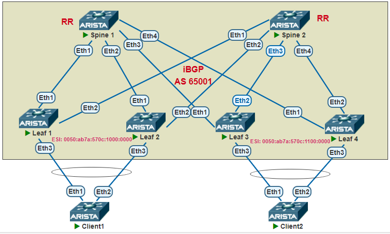
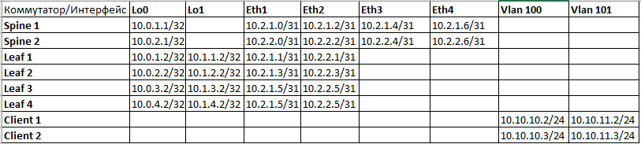

## **VXLAN. Multihoming.**
## **Цель: Настроить отказоустойчивое подключение клиентов с использованием EVPN Multihoming**
## **Описание/Пошаговая инструкция:**
1. Настроить Underlay и Overlay.
2. Настроить EVPN.
3. Добавить на Leaf клиентские VLAN-ы, связать их c VNI
4. Настроить MAC VRF BGP для клиентских Vlan-ов на всех Leaf, настроить RD, RT import, RT export.
5. Создать Port-Channel на Leaf, настроить ethernet-segment: указать esi, route-target import и lacp system-id одинаковые на каждой паре Лифов.
6. Добавить клиентские порты в channel-group.
7. Настроить portchannel на клиентских устройствах, добавить соответствующие вланы, прописать ip адреса.
8. Убедиться в наличии связности между клиентами в каждом из вланов.
9. Убедиться в наличии маршрутов Type-1 и Type-4 на Leaf, а также проверить что в каждой группе Leaf выбран Designated Forward.

### **Схема сети**

## **Выполнение работы:**
1. Настраиваем адресацию интерфейсов устройств согласно таблицы:

2. Настраиваем Underlay и Overlay:
```
Spine 1:

route-map Import_Connected permit 10
   match interface Loopback0

router bgp 65001
   router-id 10.0.1.1
   timers bgp 3 9
   neighbor Leaf peer group
   neighbor Leaf remote-as 65001
   neighbor Leaf next-hop-self
   neighbor Leaf route-reflector-client
   neighbor Leaf password 7 BSYOW9qB7q2ag3gSwKzaXWXixR/0fMDN
   neighbor Leaf_lo peer group
   neighbor Leaf_lo remote-as 65001
   neighbor Leaf_lo update-source Loopback0
   neighbor Leaf_lo route-reflector-client
   neighbor Leaf_lo password 7 JRqY1nLadNRvhkjGCpNcBx8q7Vd3IaKY
   neighbor Leaf_lo send-community extended
   neighbor 10.0.1.2 peer group Leaf_lo
   neighbor 10.0.2.2 peer group Leaf_lo
   neighbor 10.0.3.2 peer group Leaf_lo
   neighbor 10.0.4.2 peer group Leaf_lo
   neighbor 10.2.1.1 peer group Leaf
   neighbor 10.2.1.3 peer group Leaf
   neighbor 10.2.1.5 peer group Leaf
   neighbor 10.2.1.7 peer group Leaf
   redistribute connected route-map Import_Connected
   
   address-family evpn
      no neighbor Leaf activate
      no neighbor Leaf next-hop-unchanged
      neighbor Leaf_lo activate
   
   address-family ipv4
      no neighbor Leaf_lo activate


Leaf 4

route-map Import_Connected permit 10
   match interface Loopback0

route-map Import_Connected permit 20
   match interface Loopback1

router bgp 65001
   router-id 10.0.4.2
   maximum-paths 2
   neighbor Spine peer group
   neighbor Spine remote-as 65001
   neighbor Spine password 7 cvxnRM6ECvqiRRVq05gzqn3sC8FZTVbY
   neighbor Spine_lo peer group
   neighbor Spine_lo remote-as 65001
   neighbor Spine_lo update-source Loopback0
   neighbor Spine_lo password 7 kdTaBtWkPJjFehLXW2l23U7GUnXndnrV
   neighbor Spine_lo send-community extended
   neighbor 10.0.1.1 peer group Spine_lo
   neighbor 10.0.2.1 peer group Spine_lo
   neighbor 10.2.1.6 peer group Spine
   neighbor 10.2.2.6 peer group Spine
   redistribute connected route-map Import_Connected
   
   vlan 100
      rd auto
      route-target export auto
      route-target import auto 65001
      redistribute learned
   
   vlan 101
      rd auto
      route-target export auto
      route-target import auto 65001
      redistribute learned
   
   address-family evpn
      no neighbor Spine activate
      neighbor Spine_lo activate
   
   address-family ipv4
      no neighbor Spine_lo activate


```
3. Настраиваем Port-Channel, Ethernet-segment:

```
Leaf 1:

interface Port-Channel1
   switchport trunk allowed vlan 100-101
   switchport mode trunk
   !
   evpn ethernet-segment
      identifier 0050:ab7a:570c:1000:0000
      route-target import 50:ab:7a:57:0c:10
   lacp system-id 50ab.7a57.0c10

interface Ethernet3
   channel-group 1 mode active

Leaf 4:

interface Port-Channel1
   switchport trunk allowed vlan 100-101
   switchport mode trunk
   !
   evpn ethernet-segment
      identifier 0050:ab7a:570c:1100:0000
      route-target import 50:ab:7a:57:0c:11
   lacp system-id 50ab.7a57.0c11

interface Ethernet3
   channel-group 1 mode active


```
4. Настраиваем клиентские устройства:
```
Client 1:

interface Port-Channel1
   no switchport

interface Port-Channel1.100
   encapsulation dot1q vlan 100
   ip address 10.10.10.2/24

interface Port-Channel1.101
   encapsulation dot1q vlan 101
   ip address 10.10.11.2/24

interface Ethernet1
   channel-group 1 mode active

interface Ethernet2
   channel-group 1 mode active

Client 2:

interface Port-Channel1
   no switchport
!
interface Port-Channel1.100
   encapsulation dot1q vlan 100
   ip address 10.10.10.3/24
!
interface Port-Channel1.101
   encapsulation dot1q vlan 101
   ip address 10.10.11.3/24
!
interface Ethernet1
   channel-group 1 mode active
!
interface Ethernet2
   channel-group 1 mode active


```

5. Проверяем наличие связности между клиентами в 100 и в 101 вланах:

```
Client 1:

VPCS> ping 10.10.10.1

84 bytes from 10.10.10.1 icmp_seq=1 ttl=64 time=100.565 ms
84 bytes from 10.10.10.1 icmp_seq=2 ttl=64 time=17.080 ms
84 bytes from 10.10.10.1 icmp_seq=3 ttl=64 time=7.520 ms
84 bytes from 10.10.10.1 icmp_seq=4 ttl=64 time=18.621 ms
84 bytes from 10.10.10.1 icmp_seq=5 ttl=64 time=8.220 ms

```

6. Проверяем связность между клиентами:

```
Client 1:

Client1#ping 10.10.10.3
PING 10.10.10.3 (10.10.10.3) 72(100) bytes of data.
80 bytes from 10.10.10.3: icmp_seq=1 ttl=64 time=103 ms
80 bytes from 10.10.10.3: icmp_seq=2 ttl=64 time=104 ms
80 bytes from 10.10.10.3: icmp_seq=3 ttl=64 time=104 ms
80 bytes from 10.10.10.3: icmp_seq=4 ttl=64 time=102 ms
80 bytes from 10.10.10.3: icmp_seq=5 ttl=64 time=101 ms

Client1#ping 10.10.11.3
PING 10.10.11.3 (10.10.11.3) 72(100) bytes of data.
80 bytes from 10.10.11.3: icmp_seq=1 ttl=64 time=128 ms
80 bytes from 10.10.11.3: icmp_seq=2 ttl=64 time=128 ms
80 bytes from 10.10.11.3: icmp_seq=3 ttl=64 time=150 ms
80 bytes from 10.10.11.3: icmp_seq=4 ttl=64 time=149 ms
80 bytes from 10.10.11.3: icmp_seq=5 ttl=64 time=143 ms

Client1#show ip arp 
Address         Age (sec)  Hardware Addr   Interface
10.10.10.3        3:30:49  5090.c7cf.3247  Port-Channel1.100
10.10.11.3        2:09:02  5090.c7cf.3247  Port-Channel1.101

```
7. Убеждаемся, что на Leaf есть соответствующие маршруты EVPN Type 1 и Type 4 :

```
Leaf 1:

Leaf2#show bgp evpn route-type auto-discovery 
BGP routing table information for VRF default
Router identifier 10.0.2.2, local AS number 65001
Route status codes: * - valid, > - active, S - Stale, E - ECMP head, e - ECMP
                    c - Contributing to ECMP, % - Pending BGP convergence
Origin codes: i - IGP, e - EGP, ? - incomplete
AS Path Attributes: Or-ID - Originator ID, C-LST - Cluster List, LL Nexthop - Link Local Nexthop

          Network                Next Hop              Metric  LocPref Weight  Path
 * >Ec    RD: 10.0.1.2:100 auto-discovery 0 0050:ab7a:570c:1000:0000
                                 10.1.1.2              -       100     0       i Or-ID: 10.0.1.2 C-LST: 10.0.2.1 
 *  ec    RD: 10.0.1.2:100 auto-discovery 0 0050:ab7a:570c:1000:0000
                                 10.1.1.2              -       100     0       i Or-ID: 10.0.1.2 C-LST: 10.0.1.1 
 * >Ec    RD: 10.0.1.2:101 auto-discovery 0 0050:ab7a:570c:1000:0000
                                 10.1.1.2              -       100     0       i Or-ID: 10.0.1.2 C-LST: 10.0.2.1 
 *  ec    RD: 10.0.1.2:101 auto-discovery 0 0050:ab7a:570c:1000:0000
                                 10.1.1.2              -       100     0       i Or-ID: 10.0.1.2 C-LST: 10.0.1.1 
 * >      RD: 10.0.2.2:100 auto-discovery 0 0050:ab7a:570c:1000:0000
                                 -                     -       -       0       i
 * >      RD: 10.0.2.2:101 auto-discovery 0 0050:ab7a:570c:1000:0000
                                 -                     -       -       0       i
 * >Ec    RD: 10.1.1.2:1 auto-discovery 0050:ab7a:570c:1000:0000
                                 10.1.1.2              -       100     0       i Or-ID: 10.0.1.2 C-LST: 10.0.2.1 
 *  ec    RD: 10.1.1.2:1 auto-discovery 0050:ab7a:570c:1000:0000
                                 10.1.1.2              -       100     0       i Or-ID: 10.0.1.2 C-LST: 10.0.1.1 
 * >      RD: 10.1.2.2:1 auto-discovery 0050:ab7a:570c:1000:0000
                                 -                     -       -       0       i
 * >Ec    RD: 10.0.3.2:100 auto-discovery 0 0050:ab7a:570c:1100:0000
                                 10.1.3.2              -       100     0       i Or-ID: 10.0.3.2 C-LST: 10.0.2.1 
 *  ec    RD: 10.0.3.2:100 auto-discovery 0 0050:ab7a:570c:1100:0000
                                 10.1.3.2              -       100     0       i Or-ID: 10.0.3.2 C-LST: 10.0.1.1 
 * >Ec    RD: 10.0.3.2:101 auto-discovery 0 0050:ab7a:570c:1100:0000
                                 10.1.3.2              -       100     0       i Or-ID: 10.0.3.2 C-LST: 10.0.2.1 
 *  ec    RD: 10.0.3.2:101 auto-discovery 0 0050:ab7a:570c:1100:0000
                                 10.1.3.2              -       100     0       i Or-ID: 10.0.3.2 C-LST: 10.0.1.1 
 * >Ec    RD: 10.0.4.2:100 auto-discovery 0 0050:ab7a:570c:1100:0000
                                 10.1.4.2              -       100     0       i Or-ID: 10.0.4.2 C-LST: 10.0.2.1 
 *  ec    RD: 10.0.4.2:100 auto-discovery 0 0050:ab7a:570c:1100:0000
                                 10.1.4.2              -       100     0       i Or-ID: 10.0.4.2 C-LST: 10.0.1.1 
 * >Ec    RD: 10.0.4.2:101 auto-discovery 0 0050:ab7a:570c:1100:0000
                                 10.1.4.2              -       100     0       i Or-ID: 10.0.4.2 C-LST: 10.0.2.1 
 *  ec    RD: 10.0.4.2:101 auto-discovery 0 0050:ab7a:570c:1100:0000
                                 10.1.4.2              -       100     0       i Or-ID: 10.0.4.2 C-LST: 10.0.1.1 
 * >Ec    RD: 10.1.3.2:1 auto-discovery 0050:ab7a:570c:1100:0000
                                 10.1.3.2              -       100     0       i Or-ID: 10.0.3.2 C-LST: 10.0.2.1 
 *  ec    RD: 10.1.3.2:1 auto-discovery 0050:ab7a:570c:1100:0000
                                 10.1.3.2              -       100     0       i Or-ID: 10.0.3.2 C-LST: 10.0.1.1 
 * >Ec    RD: 10.1.4.2:1 auto-discovery 0050:ab7a:570c:1100:0000
                                 10.1.4.2              -       100     0       i Or-ID: 10.0.4.2 C-LST: 10.0.2.1 
 *  ec    RD: 10.1.4.2:1 auto-discovery 0050:ab7a:570c:1100:0000
                                 10.1.4.2              -       100     0       i Or-ID: 10.0.4.2 C-LST: 10.0.1.1 

Leaf 4:

Leaf4#show bgp evpn route-type ethernet-segment 
BGP routing table information for VRF default
Router identifier 10.0.4.2, local AS number 65001
Route status codes: * - valid, > - active, S - Stale, E - ECMP head, e - ECMP
                    c - Contributing to ECMP, % - Pending BGP convergence
Origin codes: i - IGP, e - EGP, ? - incomplete
AS Path Attributes: Or-ID - Originator ID, C-LST - Cluster List, LL Nexthop - Link Local Nexthop

          Network                Next Hop              Metric  LocPref Weight  Path
 * >Ec    RD: 10.1.1.2:1 ethernet-segment 0050:ab7a:570c:1000:0000 10.1.1.2
                                 10.1.1.2              -       100     0       i Or-ID: 10.0.1.2 C-LST: 10.0.2.1 
 *  ec    RD: 10.1.1.2:1 ethernet-segment 0050:ab7a:570c:1000:0000 10.1.1.2
                                 10.1.1.2              -       100     0       i Or-ID: 10.0.1.2 C-LST: 10.0.1.1 
 * >Ec    RD: 10.1.2.2:1 ethernet-segment 0050:ab7a:570c:1000:0000 10.1.2.2
                                 10.1.2.2              -       100     0       i Or-ID: 10.0.2.2 C-LST: 10.0.2.1 
 *  ec    RD: 10.1.2.2:1 ethernet-segment 0050:ab7a:570c:1000:0000 10.1.2.2
                                 10.1.2.2              -       100     0       i Or-ID: 10.0.2.2 C-LST: 10.0.1.1 
 * >Ec    RD: 10.1.3.2:1 ethernet-segment 0050:ab7a:570c:1100:0000 10.1.3.2
                                 10.1.3.2              -       100     0       i Or-ID: 10.0.3.2 C-LST: 10.0.2.1 
 *  ec    RD: 10.1.3.2:1 ethernet-segment 0050:ab7a:570c:1100:0000 10.1.3.2
                                 10.1.3.2              -       100     0       i Or-ID: 10.0.3.2 C-LST: 10.0.1.1 
 * >      RD: 10.1.4.2:1 ethernet-segment 0050:ab7a:570c:1100:0000 10.1.4.2
                                 -                     -       -       0       i

```

8. Проверяем что в каждой паре Leaf выбран DF:

```
Leaf 3:

Leaf3#show bgp evpn instance 
EVPN instance: VLAN 100
  Route distinguisher: 0:0
  Route target import: 
  Route target export: 
  Service interface: VLAN-based
  Local VXLAN IP address: 10.1.3.2
  VXLAN: enabled
  MPLS: disabled
  Local ethernet segment:
    ESI: 0050:ab7a:570c:1100:0000
      Interface: Port-Channel1
      Mode: all-active
      State: up
      ES-Import RT: 50:ab:7a:57:0c:11
      DF election algorithm: modulus
      Designated forwarder: 10.1.3.2
      Non-Designated forwarder: 10.1.4.2
EVPN instance: VLAN 101
  Route distinguisher: 0:0
  Route target import: 
  Route target export: 
  Service interface: VLAN-based
  Local VXLAN IP address: 10.1.3.2
  VXLAN: enabled
  MPLS: disabled
  Local ethernet segment:
    ESI: 0050:ab7a:570c:1100:0000
      Interface: Port-Channel1
      Mode: all-active
      State: up
      ES-Import RT: 50:ab:7a:57:0c:11
      DF election algorithm: modulus
      Designated forwarder: 10.1.4.2
      Non-Designated forwarder: 10.1.3.2

```


