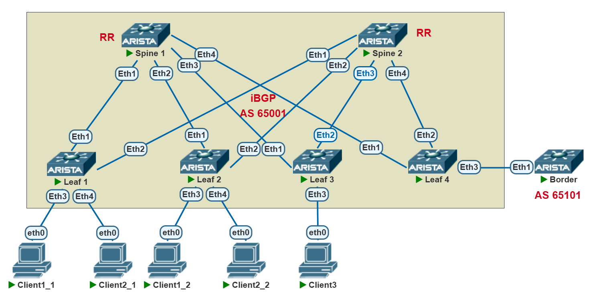
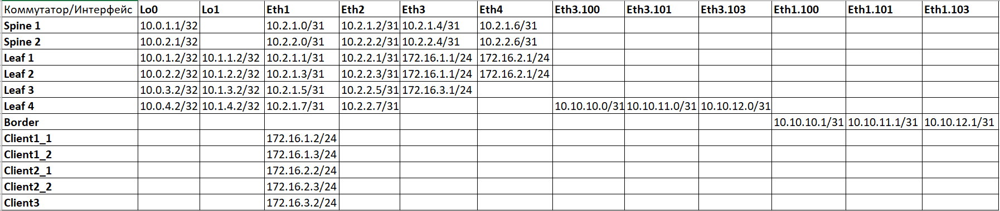

## **VXLAN. Routing.**
## **Цель: Реализовать маршрутизацию между "клиентами" через EVPN route-type 5**
## **Описание/Пошаговая инструкция:**
1. Настроить Underlay и Overlay.
2. Настроить EVPN.
3. Добавить на Leaf клиентские VLAN-ы, связать их c VNI
4. Настроить MAC VRF BGP для клиентских Vlan-ов на всех Leaf, настроить RD, RT import, RT export.
5. Создать VRF Client1, Client2 на Leaf1, Leaf2 и VRF Client3 на Leaf3.
6. Настроить Vlanif интерфейсы на лифах, добавить их в соответствующие VRF: vlanif 100 - VRF Client1, vlanif 101 - VRF Client2, vlanif 103 - VRF Client3.
7. Настроить пользовательские интерфейсы, добавить их в соответстующие вланы.
8. Настроить VRF-ы в контексте BGP, указать route target-ы на импорт и на экспорт, настроить редистрибуцию connected сетей.
9. Убедиться в наличии связности между клиентами в каждом из вланов, а также в отсутствии связности между клиентами из разных VRF.
10. Настроить Leaf 4 в качестве пограничного бордера, добавить все VRF, настроить BGP соседство в каждом из VRF с пограничным маршутизатоом Border.
11. На маршрутизаторе Border настроить BGP, указать route-map для фильтрации маршрутов между VRF.
12. Убедиться в связности между клиентами в разных vrf, а также в наличии дефолтного маршрута в VRF Client3.

### **Схема сети**

## **Выполнение работы:**
1. Настраиваем адресацию интерфейсов устройств согласно таблицы:

2. Настраиваем Underlay и Overlay:
```
Spine 1:

route-map Import_Connected permit 10
   match interface Loopback0

router bgp 65001
   router-id 10.0.1.1
   timers bgp 3 9
   neighbor Leaf peer group
   neighbor Leaf remote-as 65001
   neighbor Leaf next-hop-self
   neighbor Leaf route-reflector-client
   neighbor Leaf password 7 BSYOW9qB7q2ag3gSwKzaXWXixR/0fMDN
   neighbor Leaf_lo peer group
   neighbor Leaf_lo remote-as 65001
   neighbor Leaf_lo update-source Loopback0
   neighbor Leaf_lo route-reflector-client
   neighbor Leaf_lo password 7 JRqY1nLadNRvhkjGCpNcBx8q7Vd3IaKY
   neighbor Leaf_lo send-community extended
   neighbor 10.0.1.2 peer group Leaf_lo
   neighbor 10.0.2.2 peer group Leaf_lo
   neighbor 10.0.3.2 peer group Leaf_lo
   neighbor 10.0.4.2 peer group Leaf_lo
   neighbor 10.2.1.1 peer group Leaf
   neighbor 10.2.1.3 peer group Leaf
   neighbor 10.2.1.5 peer group Leaf
   neighbor 10.2.1.7 peer group Leaf
   redistribute connected route-map Import_Connected
   
   address-family evpn
      no neighbor Leaf activate
      no neighbor Leaf next-hop-unchanged
      neighbor Leaf_lo activate
   
   address-family ipv4
      no neighbor Leaf_lo activate


Leaf 4

route-map Import_Connected permit 10
   match interface Loopback0

route-map Import_Connected permit 20
   match interface Loopback1

router bgp 65001
   router-id 10.0.4.2
   maximum-paths 2
   neighbor Spine peer group
   neighbor Spine remote-as 65001
   neighbor Spine password 7 cvxnRM6ECvqiRRVq05gzqn3sC8FZTVbY
   neighbor Spine_lo peer group
   neighbor Spine_lo remote-as 65001
   neighbor Spine_lo update-source Loopback0
   neighbor Spine_lo password 7 kdTaBtWkPJjFehLXW2l23U7GUnXndnrV
   neighbor Spine_lo send-community extended
   neighbor 10.0.1.1 peer group Spine_lo
   neighbor 10.0.2.1 peer group Spine_lo
   neighbor 10.2.1.6 peer group Spine
   neighbor 10.2.2.6 peer group Spine
   redistribute connected route-map Import_Connected
     
   address-family evpn
      no neighbor Spine activate
      neighbor Spine_lo activate
   
   address-family ipv4
      no neighbor Spine_lo activate


```
3. Настраиваем вланы на Leaf, привязываем их к VNI, создаем VRF, настраиваем ip адресацию в пользовательских вланах. Client1_1 на первом Leaf и Client1_2 на втором Leaf - влан 100 и VRF Client1; Client2_1 на первом Leaf и Client2_2 на Leaf2 - 101 vlan и VRF Client2; Client3 - влан 103 и VRF Client3 на 3 Leaf:

```
Leaf 1:

vlan 100
   name VNI-1100

vlan 101
   name VNI-1101

vrf instance Client_1

vrf instance Client_2

interface Ethernet3
   description -=Client1_1=-
   switchport access vlan 100

interface Ethernet4
   description -=Client2_1=-
   switchport access vlan 101

interface Vxlan1
   vxlan source-interface Loopback1
   vxlan udp-port 4789
   vxlan vlan 100 vni 1100
   vxlan vlan 101 vni 1101
   vxlan vrf Client_1 vni 10001
   vxlan vrf Client_2 vni 10002

ip routing vrf Client_1
ip routing vrf Client_2

router bgp 65001
  
   vlan 100
      rd auto
      route-target export auto
      route-target import auto 65001
      redistribute learned
  
   vlan 101
      rd auto
      route-target export auto
      route-target import auto 65001
      redistribute learned
  
   vrf Client_1
      rd 10.1.1.2:1
      route-target import evpn 1:10001
      route-target export evpn 1:10001
      redistribute connected
   
   vrf Client_2
      rd 10.1.1.2:2
      route-target import evpn 1:10002
      route-target export evpn 1:10002
      redistribute connected

Leaf2:

vlan 100
   name VNI-1100

vlan 101
   name VNI-1101

vrf instance Client_1

vrf instance Client_2

interface Ethernet3
   description -=Client1_1=-
   switchport access vlan 100

interface Ethernet4
   description -=Client2_1=-
   switchport access vlan 101

interface Vlan100
   vrf Client_1
   ip address 172.16.1.1/24

interface Vlan101
   vrf Client_2
   ip address 172.16.2.1/24

interface Vxlan1
   vxlan source-interface Loopback1
   vxlan udp-port 4789
   vxlan vlan 100 vni 1100
   vxlan vlan 101 vni 1101
   vxlan vrf Client_1 vni 10001
   vxlan vrf Client_2 vni 10002

ip routing vrf Client_1
ip routing vrf Client_2

router bgp 65001

   vlan 100
      rd auto
      route-target export auto
      route-target import auto 65001
      redistribute learned
  
   vlan 101
      rd auto
      route-target export auto
      route-target import auto 65001
      redistribute learned
 
   vrf Client_1
      rd 10.1.2.2:1
      route-target import evpn 1:10001
      route-target export evpn 1:10001
      redistribute connected
  
   vrf Client_2
      rd 10.1.2.2:2
      route-target import evpn 1:10002
      route-target export evpn 1:10002
      redistribute connected

```
4. Настраиваем клиентские устройства, проверяем наличие связности между клиентами в одном VNI на разных лифах и в отсутствии связности между клиентами в разных VNI и разных VRF:
```
Client1_1:

ping 172.16.1.3

84 bytes from 172.16.1.3 icmp_seq=1 ttl=64 time=124.726 ms
84 bytes from 172.16.1.3 icmp_seq=2 ttl=64 time=45.169 ms
84 bytes from 172.16.1.3 icmp_seq=3 ttl=64 time=133.626 ms
84 bytes from 172.16.1.3 icmp_seq=4 ttl=64 time=42.381 ms
84 bytes from 172.16.1.3 icmp_seq=5 ttl=64 time=52.698 ms

ping 172.16.2.2    

*172.16.1.1 icmp_seq=1 ttl=64 time=7.832 ms (ICMP type:3, code:0, Destination network unreac
hable)
*172.16.1.1 icmp_seq=2 ttl=64 time=10.073 ms (ICMP type:3, code:0, Destination network unrea
chable)
*172.16.1.1 icmp_seq=3 ttl=64 time=12.380 ms (ICMP type:3, code:0, Destination network unrea
chable)
*172.16.1.1 icmp_seq=4 ttl=64 time=24.194 ms (ICMP type:3, code:0, Destination network unrea
chable)
*172.16.1.1 icmp_seq=5 ttl=64 time=8.757 ms (ICMP type:3, code:0, Destination network unreac
hable)

Client2_2:

ping 172.16.2.2

84 bytes from 172.16.2.2 icmp_seq=1 ttl=64 time=149.975 ms
84 bytes from 172.16.2.2 icmp_seq=2 ttl=64 time=149.455 ms
84 bytes from 172.16.2.2 icmp_seq=3 ttl=64 time=44.464 ms
84 bytes from 172.16.2.2 icmp_seq=4 ttl=64 time=183.061 ms
84 bytes from 172.16.2.2 icmp_seq=5 ttl=64 time=37.518 ms

ping 172.16.3.2

*172.16.2.1 icmp_seq=1 ttl=64 time=52.067 ms (ICMP type:3, code:0, Destination network unrea
chable)
*172.16.2.1 icmp_seq=2 ttl=64 time=8.502 ms (ICMP type:3, code:0, Destination network unreac
hable)
*172.16.2.1 icmp_seq=3 ttl=64 time=7.856 ms (ICMP type:3, code:0, Destination network unreac
hable)
*172.16.2.1 icmp_seq=4 ttl=64 time=8.455 ms (ICMP type:3, code:0, Destination network unreac
hable)
*172.16.2.1 icmp_seq=5 ttl=64 time=8.557 ms (ICMP type:3, code:0, Destination network unreac
hable)

```
Убеждаемся, что на Лифах в VRF присутствуют только connected сети и Host роуты полученные по EVPN:
Leaf1#show ip route vrf Client_2

VRF: Client_2
Codes: C - connected, S - static, K - kernel, 
       O - OSPF, IA - OSPF inter area, E1 - OSPF external type 1,
       E2 - OSPF external type 2, N1 - OSPF NSSA external type 1,
       N2 - OSPF NSSA external type2, B - Other BGP Routes,
       B I - iBGP, B E - eBGP, R - RIP, I L1 - IS-IS level 1,
       I L2 - IS-IS level 2, O3 - OSPFv3, A B - BGP Aggregate,
       A O - OSPF Summary, NG - Nexthop Group Static Route,
       V - VXLAN Control Service, M - Martian,
       DH - DHCP client installed default route,
       DP - Dynamic Policy Route, L - VRF Leaked,
       G  - gRIBI, RC - Route Cache Route

Gateway of last resort is not set

 B I      172.16.2.3/32 [200/0] via VTEP 10.1.2.2 VNI 10002 router-mac 50:8a:59:1b:ea:ee loc
al-interface Vxlan1
 C        172.16.2.0/24 is directly connected, Vlan101

5. Настраиваем Leaf4 в качестве Border Leaf:

Добавляем все VRF между которыми необходима маршрутизация или которым необходим доступ во внешние сети, создаем сабинтерфейсы для пиринга с Border, настраиваем BGP для соответствующих VRF:

```
Leaf4:

vrf instance Client_1

vrf instance Client_2

vrf instance Client_3

interface Ethernet3
   description -=Uplink=-
   no switchport

interface Ethernet3.100
   encapsulation dot1q vlan 100
   vrf Client_1
   ip address 10.10.10.0/31

interface Ethernet3.101
   encapsulation dot1q vlan 101
   vrf Client_2
   ip address 10.10.11.0/31

interface Ethernet3.103
   encapsulation dot1q vlan 103
   vrf Client_3
   ip address 10.10.12.0/31

interface Vxlan1
   vxlan source-interface Loopback1
   vxlan udp-port 4789
   vxlan vrf Client_1 vni 10001
   vxlan vrf Client_2 vni 10002
   vxlan vrf Client_3 vni 10003

ip routing vrf Client_1
ip routing vrf Client_2
ip routing vrf Client_3

router bgp 65001

   vrf Client_1
      rd 10.1.4.2:1
      route-target import 1:10001
      route-target import evpn 1:10001
      route-target export evpn 1:10001
      neighbor 10.10.10.1 remote-as 65101
 
   vrf Client_2
      rd 10.1.4.2:2
      route-target import 1:10002
      route-target import evpn 1:10002
      route-target export evpn 1:10002
      neighbor 10.10.11.1 remote-as 65101

   vrf Client_3
      rd 10.1.4.2:3
      route-target import evpn 1:10003
      route-target export evpn 1:10003
      neighbor 10.10.12.1 remote-as 65101

```

6. Настраиваем Border. Создаем сабинтерфейсы, настраиваем route-map следующим образом: 
   а) разрешаем прием сетей только с 24 маской чтобы уменьшить количество маршрутов, исключив host route; 
   б) запрещаем анонс маршрутов Client3 в сторону Client1 и Client2;
   в) так как Leaf4 не примет анонсы в которых будет его номер AS (65001), то подменяем номер AS при анонсе в сторону Leaf4 на свой (65101) для всех BGP соседств
Настраиваем BGP пиринг, для Client3 анонсируем дефолтный маршрут:

```
Border:

interface Ethernet1.100
   description -=VRF_Client1=-
   encapsulation dot1q vlan 100
   ip address 10.10.10.1/31

interface Ethernet1.101
   description -=VRF_Client2=-
   encapsulation dot1q vlan 101
   ip address 10.10.11.1/31

interface Ethernet1.103
   description -=VRF_Client3=-
   encapsulation dot1q vlan 103
   ip address 10.10.12.1/31

ip routing

ip prefix-list Client1_in seq 10 permit 172.16.1.0/24 eq 24
ip prefix-list Client2_in seq 10 permit 172.16.2.0/24 eq 24
ip prefix-list Client3_def seq 10 permit 0.0.0.0/0
ip prefix-list Client3_in seq 10 permit 172.16.3.0/24 eq 24

route-map Client1_in permit 10
   match ip address prefix-list Client1_in

route-map Client1_out deny 5
   match ip address prefix-list Client3_in

route-map Client1_out permit 10
   set as-path match all replacement auto

route-map Client2_in permit 10
   match ip address prefix-list Client2_in

route-map Client2_out deny 5
   match ip address prefix-list Client3_in

route-map Client2_out permit 10
   set as-path match all replacement auto

route-map Client3_in permit 10
   match ip address prefix-list Client3_in

route-map Client3_out permit 10
   match ip address prefix-list Client3_def
   set as-path match all replacement auto

router bgp 65101
   neighbor 10.10.10.0 remote-as 65001
   neighbor 10.10.10.0 route-map Client1_in in
   neighbor 10.10.10.0 route-map Client1_out out
   neighbor 10.10.11.0 remote-as 65001
   neighbor 10.10.11.0 route-map Client2_in in
   neighbor 10.10.11.0 route-map Client2_out out
   neighbor 10.10.12.0 remote-as 65001
   neighbor 10.10.12.0 route-map Client3_in in
   neighbor 10.10.12.0 route-map Client3_out out
   neighbor 10.10.12.0 default-originate always

```
7. Проверяем наличие связности между клиентами в VRF Client1 и Client2, а также в отсутствии связности Client3 с другими VRF:

```
Client1_1
ping 172.16.2.2

84 bytes from 172.16.2.2 icmp_seq=1 ttl=59 time=353.905 ms
84 bytes from 172.16.2.2 icmp_seq=2 ttl=59 time=96.817 ms
84 bytes from 172.16.2.2 icmp_seq=3 ttl=59 time=101.543 ms
84 bytes from 172.16.2.2 icmp_seq=4 ttl=59 time=212.198 ms
84 bytes from 172.16.2.2 icmp_seq=5 ttl=59 time=203.293 ms

ping 172.16.2.3

84 bytes from 172.16.2.3 icmp_seq=1 ttl=59 time=591.461 ms
84 bytes from 172.16.2.3 icmp_seq=2 ttl=59 time=770.037 ms
84 bytes from 172.16.2.3 icmp_seq=3 ttl=59 time=128.580 ms
84 bytes from 172.16.2.3 icmp_seq=4 ttl=59 time=391.404 ms
84 bytes from 172.16.2.3 icmp_seq=5 ttl=59 time=310.003 ms

Client3:

ping 172.16.1.2

172.16.1.2 icmp_seq=1 timeout
172.16.1.2 icmp_seq=2 timeout
172.16.1.2 icmp_seq=3 timeout
172.16.1.2 icmp_seq=4 timeout
172.16.1.2 icmp_seq=5 timeout

ping 172.16.2.3

172.16.2.3 icmp_seq=1 timeout
172.16.2.3 icmp_seq=2 timeout
172.16.2.3 icmp_seq=3 timeout
172.16.2.3 icmp_seq=4 timeout
172.16.2.3 icmp_seq=5 timeout

При этом видно что трассировка на внешние ресурсы уходит через Border:

trace 8.8.8.8
trace to 8.8.8.8, 8 hops max, press Ctrl+C to stop
 1   172.16.3.1   9.159 ms  12.633 ms  10.527 ms
 2   10.10.12.0   38.664 ms  40.752 ms  32.224 ms
 3   *10.10.12.1   58.317 ms (ICMP type:3, code:0, Destination network unreachable) 

```

8. Проверяем наличие соответствующих маршрутов в VRF-ах:

```
Leaf 1:

Leaf1#show ip route vrf Client_1

VRF: Client_1
Codes: C - connected, S - static, K - kernel, 
       O - OSPF, IA - OSPF inter area, E1 - OSPF external type 1,
       E2 - OSPF external type 2, N1 - OSPF NSSA external type 1,
       N2 - OSPF NSSA external type2, B - Other BGP Routes,
       B I - iBGP, B E - eBGP, R - RIP, I L1 - IS-IS level 1,
       I L2 - IS-IS level 2, O3 - OSPFv3, A B - BGP Aggregate,
       A O - OSPF Summary, NG - Nexthop Group Static Route,
       V - VXLAN Control Service, M - Martian,
       DH - DHCP client installed default route,
       DP - Dynamic Policy Route, L - VRF Leaked,
       G  - gRIBI, RC - Route Cache Route

Gateway of last resort is not set
 B I      172.16.1.3/32 [200/0] via VTEP 10.1.2.2 VNI 10001 router-mac 50:8a:59:1b:ea:ee loc
al-interface Vxlan1
 C        172.16.1.0/24 is directly connected, Vlan100
 B I      172.16.2.0/24 [200/0] via VTEP 10.1.4.2 VNI 10001 router-mac 50:44:c5:ed:31:74 loc
al-interface Vxlan1

Leaf1#show ip route vrf Client_2

VRF: Client_2
Codes: C - connected, S - static, K - kernel, 
       O - OSPF, IA - OSPF inter area, E1 - OSPF external type 1,
       E2 - OSPF external type 2, N1 - OSPF NSSA external type 1,
       N2 - OSPF NSSA external type2, B - Other BGP Routes,
       B I - iBGP, B E - eBGP, R - RIP, I L1 - IS-IS level 1,
       I L2 - IS-IS level 2, O3 - OSPFv3, A B - BGP Aggregate,
       A O - OSPF Summary, NG - Nexthop Group Static Route,
       V - VXLAN Control Service, M - Martian,
       DH - DHCP client installed default route,
       DP - Dynamic Policy Route, L - VRF Leaked,
       G  - gRIBI, RC - Route Cache Route

Gateway of last resort is not set
 B I      172.16.1.0/24 [200/0] via VTEP 10.1.4.2 VNI 10002 router-mac 50:44:c5:ed:31:74 loc
al-interface Vxlan1
 B I      172.16.2.3/32 [200/0] via VTEP 10.1.2.2 VNI 10002 router-mac 50:8a:59:1b:ea:ee loc
al-interface Vxlan1
 C        172.16.2.0/24 is directly connected, Vlan101

Leaf3:

Leaf3#show ip route vrf Client_3 

VRF: Client_3
Codes: C - connected, S - static, K - kernel, 
       O - OSPF, IA - OSPF inter area, E1 - OSPF external type 1,
       E2 - OSPF external type 2, N1 - OSPF NSSA external type 1,
       N2 - OSPF NSSA external type2, B - Other BGP Routes,
       B I - iBGP, B E - eBGP, R - RIP, I L1 - IS-IS level 1,
       I L2 - IS-IS level 2, O3 - OSPFv3, A B - BGP Aggregate,
       A O - OSPF Summ

Убеждаемся в наличии route-type 5 маршрутов:

Leaf3#show bgp evpn route-type ip-prefix ipv4
BGP routing table information for VRF default
Router identifier 10.0.3.2, local AS number 65001
Route status codes: * - valid, > - active, S - Stale, E - ECMP head, e - ECMP
                    c - Contributing to ECMP, % - Pending BGP convergence
Origin codes: i - IGP, e - EGP, ? - incomplete
AS Path Attributes: Or-ID - Originator ID, C-LST - Cluster List, LL Nexthop - Link Local Nex
thop

          Network                Next Hop              Metric  LocPref Weight  Path
 * >Ec    RD: 10.1.4.2:3 ip-prefix 0.0.0.0/0
                                 10.1.4.2              -       100     0       65101 ? Or-ID
: 10.0.4.2 C-LST: 10.0.2.1 
 *  ec    RD: 10.1.4.2:3 ip-prefix 0.0.0.0/0
                                 10.1.4.2              -       100     0       65101 ? Or-ID
: 10.0.4.2 C-LST: 10.0.1.1 
 * >Ec    RD: 10.1.1.2:1 ip-prefix 172.16.1.0/24
                                 10.1.1.2              -       100     0       i Or-ID: 10.0
.1.2 C-LST: 10.0.2.1 
 *  ec    RD: 10.1.1.2:1 ip-prefix 172.16.1.0/24
.1.2 C-LST: 10.0.1.1 
 * >Ec    RD: 10.1.2.2:1 ip-prefix 172.16.1.0/24
                                 10.1.2.2              -       100     0       i Or-ID: 10.0
.2.2 C-LST: 10.0.2.1 
 *  ec    RD: 10.1.2.2:1 ip-prefix 172.16.1.0/24
                                 10.1.2.2              -       100     0       i Or-ID: 10.0
.2.2 C-LST: 10.0.1.1 
 * >Ec    RD: 10.1.4.2:2 ip-prefix 172.16.1.0/24
                                 10.1.4.2              -       100     0       65101 65101 i
 Or-ID: 10.0.4.2 C-LST: 10.0.2.1 
 *  ec    RD: 10.1.4.2:2 ip-prefix 172.16.1.0/24
                                 10.1.4.2              -       100     0       65101 65101 i
 Or-ID: 10.0.4.2 C-LST: 10.0.1.1 
 * >Ec    RD: 10.1.1.2:2 ip-prefix 172.16.2.0/24
                                 10.1.1.2              -       100     0       i Or-ID: 10.0
.1.2 C-LST: 10.0.2.1 
 *  ec    RD: 10.1.1.2:2 ip-prefix 172.16.2.0/24
                                 10.1.1.2              -       100     0       i Or-ID: 10.0
.1.2 C-LST: 10.0.1.1 
 * >Ec    RD: 10.1.2.2:2 ip-prefix 172.16.2.0/24
                                 10.1.2.2              -       100     0       i Or-ID: 10.0
.2.2 C-LST: 10.0.2.1 
 *  ec    RD: 10.1.2.2:2 ip-prefix 172.16.2.0/24
                                 10.1.2.2              -       100     0       i Or-ID: 10.0
.2.2 C-LST: 10.0.1.1 
 * >Ec    RD: 10.1.4.2:1 ip-prefix 172.16.2.0/24
                                 10.1.4.2              -       100     0       65101 65101 i
 Or-ID: 10.0.4.2 C-LST: 10.0.2.1 
 *  ec    RD: 10.1.4.2:1 ip-prefix 172.16.2.0/24
                                 10.1.4.2              -       100     0       65101 65101 i
 Or-ID: 10.0.4.2 C-LST: 10.0.1.1 
 * >      RD: 10.1.3.2:1 ip-prefix 172.16.3.0/24
                                 -                     -       -       0       i

```


