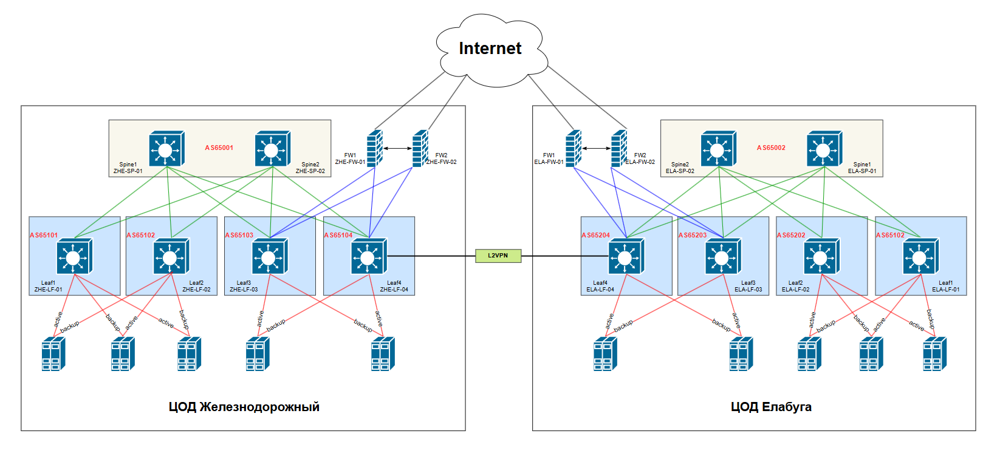
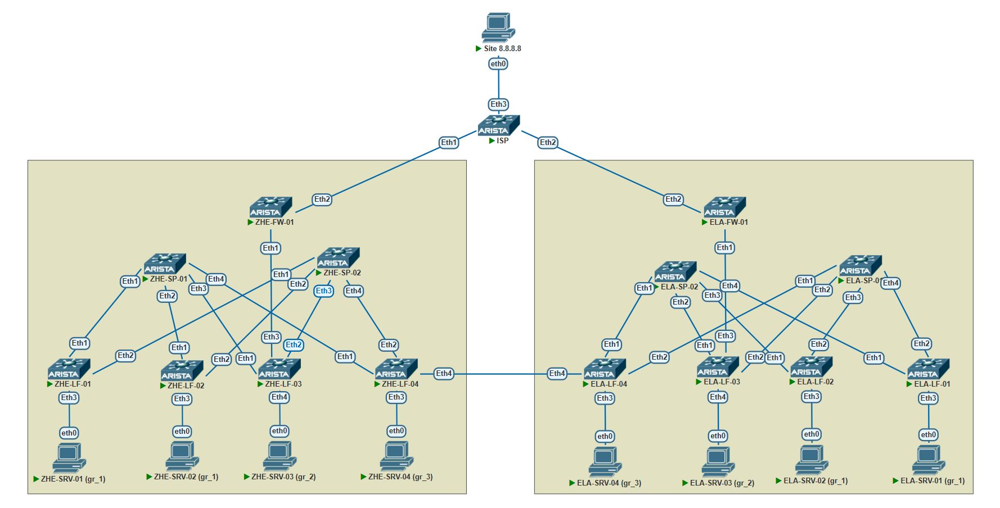

## **Проектирование сетевой фабрики с несколькими территориально разнесенными ЦОДами на основе VxLAN EVPN**

### **Описание:**
   На данный момент все вычислительные мощности компании размещаются в арендуемом ЦОДе в Москве. Было принято решение построить свое отказоустойчивое решение, одним из требований со стороны инфраструктурщиков была L2 связность между серверами для обеспечения миграции виртуальных машин между ЦОДами без изменения IP адресации. Для построения ЦОДов были выбраны территории заводов компании - в Московской области для основного ЦОДа и завод в Елабуге для резервного.
   Для организации связности между заводами предполагается аренда L2VPN канала (в последствии - двух) с обязательным требованием к размеру MTU не менее 1600 байт.
   В качестве технологии был выбран VXLAN EVPN, позволяющий обеспечить L2 связность и работающий поверх L3, что позволяет строить отказоустойчивые системы, использовать балансировку и обеспечивает быструю сходимость.
   Для Underlay/Overlay сети было решено использовать протокол eBGP. Каждый ЦОД имеет отдельное подключение к сети Интернет для доступа через VPN соединения офисов и других заводов, для этого используются кластеры из межсетевых экранов, которые помимо защиты "периметра" используются для фильтрации трафика между серверами из разных групп безопасности. Сервера планируется подключать несколькими линками к разным коммутаторам в режиме active/backup, link agregation не используется в данном случае.

### **Схема сети**


Для проверки работоспособности данного решения был собран следующий виртуальный стенд:



Настройки спайнов однотипны:

На примере Spine1:
```
ip prefix-list Import_Direct seq 10 permit 10.2.1.0/24 eq 31
!
route-map Import_Connected permit 10
   match interface Loopback0
!
router bgp 65001
   router-id 10.0.1.1
   timers bgp 3 9
   neighbor Leaf peer group
   neighbor Leaf password 7 BSYOW9qB7q2ag3gSwKzaXWXixR/0fMDN
   neighbor Leaf_lo peer group
   neighbor Leaf_lo update-source Loopback0
   neighbor Leaf_lo ebgp-multihop 2
   neighbor Leaf_lo password 7 JRqY1nLadNRvhkjGCpNcBx8q7Vd3IaKY
   neighbor Leaf_lo send-community extended
   neighbor 10.0.1.2 peer group Leaf_lo
   neighbor 10.0.1.2 remote-as 65101
   neighbor 10.0.2.2 peer group Leaf_lo
   neighbor 10.0.2.2 remote-as 65102
   neighbor 10.0.3.2 peer group Leaf_lo
   neighbor 10.0.3.2 remote-as 65103
   neighbor 10.0.4.2 peer group Leaf_lo
   neighbor 10.0.4.2 remote-as 65104
   neighbor 10.2.1.1 peer group Leaf
   neighbor 10.2.1.1 remote-as 65101
   neighbor 10.2.1.3 peer group Leaf
   neighbor 10.2.1.3 remote-as 65102
   neighbor 10.2.1.5 peer group Leaf
   neighbor 10.2.1.5 remote-as 65103
   neighbor 10.2.1.7 peer group Leaf
   neighbor 10.2.1.7 remote-as 65104
   redistribute connected route-map Import_Connected
   !
   address-family evpn
      no neighbor Leaf activate
      no neighbor Leaf next-hop-unchanged
      neighbor Leaf_lo activate
   !
   address-family ipv4
      no neighbor Leaf_lo activate
```
На лифах создаем вланы 101, 102, 103, 104, а также следующие VRF: Server_Group_1, Server_Group_2, Server_Group_3. Настраиваем anycast адреса выполняющие роль шлюзов для серверов в каждом влане на всех лифах.
Vlan 101 и vlan 104 добавляем в vrf Server_Group_1, 102 - в Server_Group_2, 103 - в Server_Group_3

Пример конфигурации второго лифа основной площадки
```
device: ZHE-LF-02 

vlan 101
   name VNI1101
!
vlan 102
   name VNI1102
!
vlan 103
   name VNI1103
!
vlan 104
   name VNI1104
!
vrf instance Server_Group_1
!
vrf instance Server_Group_2
!
vrf instance Server_Group_3

!
interface Ethernet1
   no switchport
   ip address 10.2.1.3/31
!
interface Ethernet2
   no switchport
   ip address 10.2.2.3/31
!
interface Ethernet3
   switchport access vlan 104
!
interface Loopback0
   ip address 10.0.2.2/32
!
interface Loopback1
   ip address 10.1.2.2/32
!
interface Vlan101
   vrf Server_Group_1
   ip address 10.20.1.3/24
   ip virtual-router address 10.20.1.1
!
interface Vlan102
   vrf Server_Group_2
   ip address 10.20.2.3/24
   ip virtual-router address 10.20.2.1
!
interface Vlan103
   vrf Server_Group_3
   ip address 10.20.3.3/24
   ip virtual-router address 10.20.3.1
!
interface Vlan104
   vrf Server_Group_1
   ip address 10.20.4.3/24
   ip virtual-router address 10.20.4.1
!
interface Vxlan1
   vxlan source-interface Loopback1
   vxlan udp-port 4789
   vxlan vlan 101 vni 1101
   vxlan vlan 102 vni 1102
   vxlan vlan 103 vni 1103
   vxlan vrf Server_Group_1 vni 11101
   vxlan vrf Server_Group_2 vni 11102
   vxlan vrf Server_Group_3 vni 11103
!
ip virtual-router mac-address 00:01:aa:a1:aa:a1
!
ip routing
ip routing vrf Server_Group_1
ip routing vrf Server_Group_2
ip routing vrf Server_Group_3
!
route-map Import_Connected permit 10
   match interface Loopback0
!
route-map Import_Connected permit 20
   match interface Loopback1
!
router bgp 65102
   router-id 10.0.2.2
   maximum-paths 2
   neighbor Spine peer group
   neighbor Spine remote-as 65001
   neighbor Spine password 7 cvxnRM6ECvqiRRVq05gzqn3sC8FZTVbY
   neighbor Spine_lo peer group
   neighbor Spine_lo remote-as 65001
   neighbor Spine_lo update-source Loopback0
   neighbor Spine_lo ebgp-multihop 2
   neighbor Spine_lo password 7 kdTaBtWkPJjFehLXW2l23U7GUnXndnrV
   neighbor Spine_lo send-community extended
   neighbor 10.0.1.1 peer group Spine_lo
   neighbor 10.0.2.1 peer group Spine_lo
   neighbor 10.2.1.2 peer group Spine
   neighbor 10.2.2.2 peer group Spine
   redistribute connected route-map Import_Connected
   !
   vlan 101
      rd auto
      route-target both 65000:101
      redistribute learned
   !
   vlan 102
      rd auto
      route-target both 65000:102
      redistribute learned
   !
   vlan 103
      rd auto
      route-target both 65000:103
      redistribute learned
   !
   vlan 104
      rd auto
      route-target both 65000:104
      redistribute learned
   !
   address-family evpn
      no neighbor Spine activate
      neighbor Spine_lo activate
   !
   address-family ipv4
      no neighbor Spine_lo activate
   !
   vrf Server_Group_1
      rd 10.1.2.2:1
      route-target import evpn 1:11101
      route-target export evpn 1:11101
      redistribute connected
   !
   vrf Server_Group_2
      rd 10.1.2.2:2
      route-target import evpn 1:11102
      route-target export evpn 1:11102
      redistribute connected
   !
   vrf Server_Group_3
      rd 10.1.2.2:3
      route-target import evpn 1:11103
      route-target export evpn 1:11103
      redistribute connected
```
Также настраиваем EBGP между четвертым лифом основной площадки и четвертым лифом резервной площадки. Убеждаемся что сервера в одинаковых вланах на разных площадках имеют связность между собой:
```
VPCS> ping 10.20.1.12

84 bytes from 10.20.1.12 icmp_seq=1 ttl=64 time=233.525 ms
84 bytes from 10.20.1.12 icmp_seq=2 ttl=64 time=101.877 ms
84 bytes from 10.20.1.12 icmp_seq=3 ttl=64 time=90.035 ms
84 bytes from 10.20.1.12 icmp_seq=4 ttl=64 time=444.968 ms
84 bytes from 10.20.1.12 icmp_seq=5 ttl=64 time=269.457 ms
```
Также связность есть между серверами в разных вланах но в одной VRF:

```
VPCS> trace 10.20.4.11
trace to 10.20.4.11, 8 hops max, press Ctrl+C to stop
 1   10.20.1.2   10.894 ms  7.921 ms  8.595 ms
 2   10.20.4.3   51.042 ms  50.155 ms  55.760 ms
 3   *10.20.4.11   46.518 ms 
```
Настраиваем фаерволы на площадках:
1. Настраиваем BGP сессии с Leaf3 в каждом VRF
2. Настраиваем фильтрацию маршрутов при помощи prefix-list и route-map
3. Поднимаем BGP сессию с провайдером, получаем от него дефолт который дальше анонсируем в фабрику в каждый VRF

```
ip prefix-list Server_Group1_in seq 10 permit 10.20.1.0/24 eq 24
ip prefix-list Server_Group1_out seq 10 permit 10.20.2.0/24
ip prefix-list Server_Group1_out seq 20 permit 0.0.0.0/0
ip prefix-list Server_Group2_in seq 10 permit 10.20.2.0/24 eq 24
ip prefix-list Server_Group2_out seq 10 permit 10.20.1.0/24
ip prefix-list Server_Group2_out seq 20 permit 0.0.0.0/0
ip prefix-list Server_Group3_in seq 10 permit 10.20.3.0/24 eq 24
ip prefix-list Server_Group3_out seq 20 permit 0.0.0.0/0
!
route-map Server_Group1_in permit 10
   match ip address prefix-list Server_Group1_in
!
route-map Server_Group1_out permit 20
   match ip address prefix-list Server_Group1_out
   set as-path match all replacement auto
!
route-map Server_Group2_in permit 10
   match ip address prefix-list Server_Group2_in
!
route-map Server_Group2_out permit 20
   match ip address prefix-list Server_Group2_out
   set as-path match all replacement auto
!
route-map Server_Group3_in permit 10
   match ip address prefix-list Server_Group3_in
!
route-map Server_Group3_out permit 20
   match ip address prefix-list Server_Group3_out
!
router bgp 65200
   neighbor 172.16.200.1 remote-as 65103
   neighbor 172.16.200.1 route-map Server_Group1_in in
   neighbor 172.16.200.1 route-map Server_Group1_out out
   neighbor 172.16.200.3 remote-as 65103
   neighbor 172.16.200.3 route-map Server_Group2_in in
   neighbor 172.16.200.3 route-map Server_Group2_out out
   neighbor 172.16.200.5 remote-as 65103
   neighbor 172.16.200.5 route-map Server_Group3_in in
   neighbor 172.16.200.5 route-map Server_Group3_out out
   neighbor 172.16.220.0 remote-as 65300
```

Проверяем связность между серверами в соседних VRF:
```
VPCS> trace 10.20.2.11
trace to 10.20.2.11, 8 hops max, press Ctrl+C to stop
 1   10.20.1.2   12.183 ms  9.913 ms  9.687 ms
 2   10.20.1.4   49.339 ms  68.798 ms  48.975 ms
 3   172.16.200.0   52.288 ms  64.460 ms  66.784 ms
 4   172.16.200.3   85.854 ms  65.067 ms  240.236 ms
 5   *10.20.2.11 
```
Также проверяем доступность внешних ресурсов (в нашем случае - компьютер с адресом 8.8.8.8, подключенный к маршрутизатору "провайдера"):
```
VPCS> ping 8.8.8.8

84 bytes from 8.8.8.8 icmp_seq=1 ttl=60 time=90.617 ms
84 bytes from 8.8.8.8 icmp_seq=2 ttl=60 time=253.439 ms
84 bytes from 8.8.8.8 icmp_seq=3 ttl=60 time=115.036 ms
84 bytes from 8.8.8.8 icmp_seq=4 ttl=60 time=65.573 ms
84 bytes from 8.8.8.8 icmp_seq=5 ttl=60 time=94.775 ms
```
Тесты на виртуальном стенде показали работоспособность данного решения.
